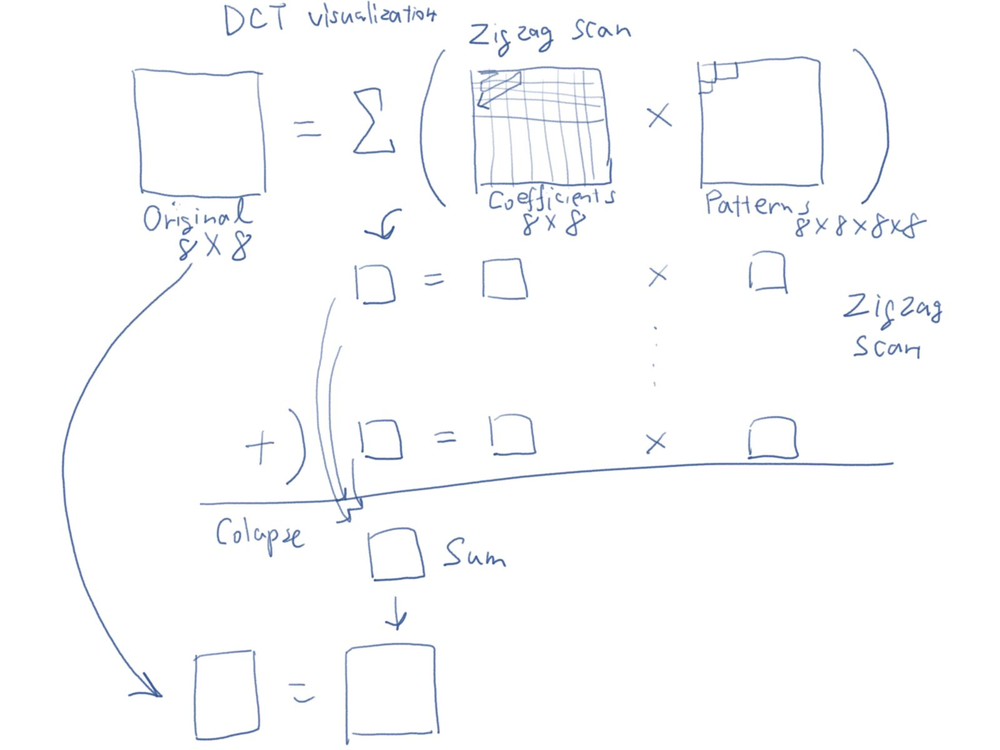

# Mathematics

## Inverse DCT visualization (Work in progress)

This project has to do with [my other edge AI project](https://github.com/araobp/edge-ai/blob/main/RockPaperScissors.md). In the edge AI project, I used DCT Type-II to extract image features of low frequencies from 8x8 heat map image. 

DCT Type-II is used for image compression such as JPEG. Refer to [the DCT page on Wikipedia](https://en.wikipedia.org/wiki/Discrete_cosine_transform).

It is very interesting to visualize inverse DCT to understand how DCT works.

