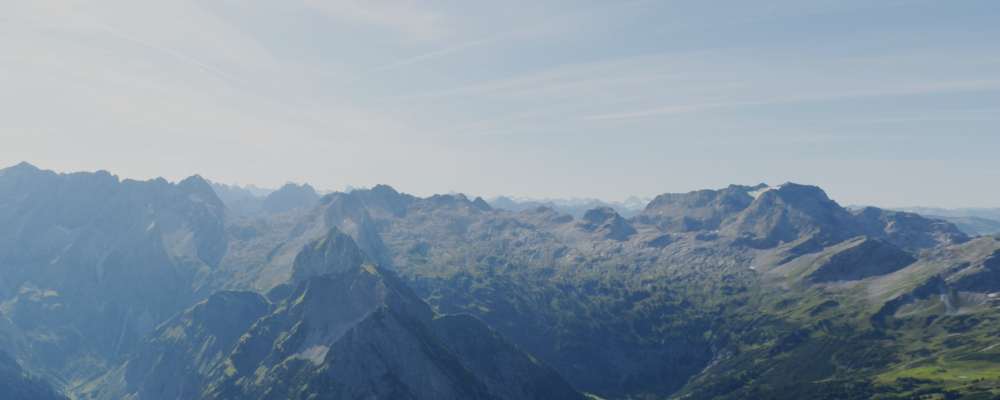
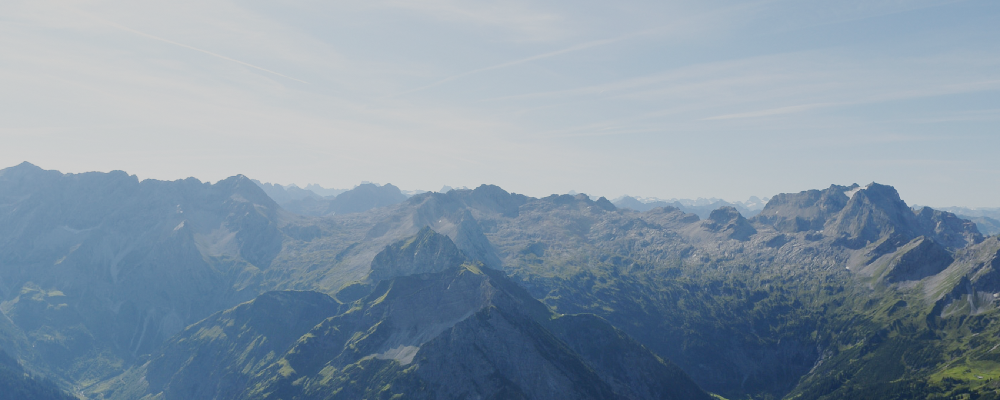
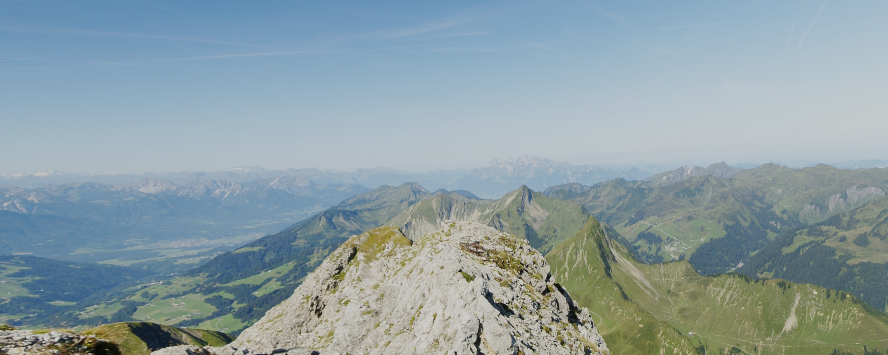

# Working with OpenCV

## Remap

It is necessary for multi-screen projection in a room to remap screen images.

=> [Notebook](remap.ipynb)

### For left wall

Remapped image

Original image

## For right wall

Remapped image

Original image

