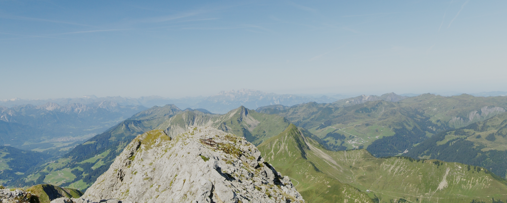

# Working with OpenCV

## Remap

It is necessary for multi-screen projection in a room to remap screen images.

=> [Notebook](remap.ipynb)

### For the left wall

Remapped image

Original image

## For the right wall

Remapped image

Original image

## For the center wall

Remapping is unnecessary

