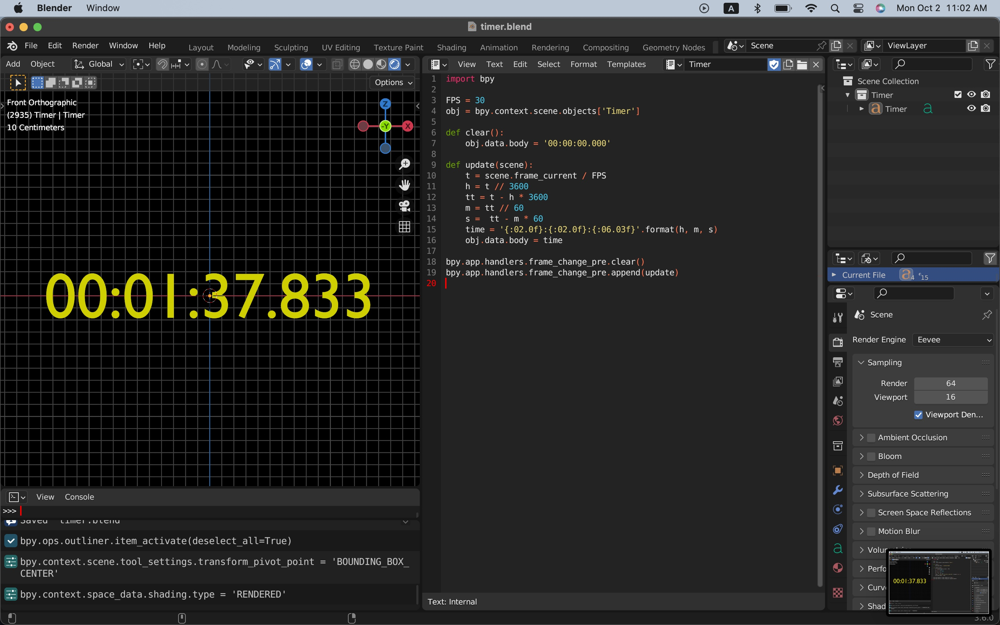

# Physics Visualization with Blender

Demo on YouTube

## Visualization

- [Physics](./Physics)
- [Physical simulations](./Simulation)
- [Mathematics](./Mathematics)

## Utility

(Click on the menu items to expand)

Seven-Segment Digital Timer

[Blender file](Util/seven_segment.blend)

This digital timer animation, which was generated by a Python script on Blender, can be inserted into physical animations to show elapsed time from the start.

https://user-images.githubusercontent.com/11053654/207276813-fa64358f-e990-455d-bcb9-a943714190fe.mp4
  

Simple Digital Timer

[Blender file](Util/timer.blend)

This is a simple timer with a Python script.

Simple Digital Timer for latency measurement

[Blender file](Util/timer2.blend)

- [3 minutes at 30FPS](TIMER_3MINUTES_30FPS_0000-5400.mp4)
- [90 seconds at 60FPS](TIMER_90SECONDS_60FPS_0000-5400.mp4)

